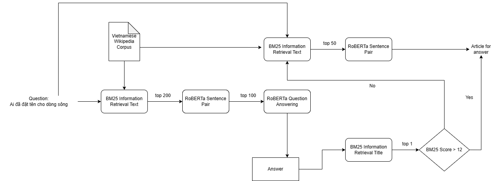

# ZAC2022 - End to End Question Answering

## Overview
This project focuses on developing a question answering system using information retrieval techniques. The goal is to build a system that can accurately answer questions posed by users based on a Wikipedia Vietnamese Corpus.

## Features
- **Question Processing**: The system will process user questions and analyze them to identify the key information and extract the intent behind the query.
- **Document Indexing**: A document indexing mechanism will be implemented to efficiently store and retrieve information from the Wikipedia Vietnamese Corpus.
- **Information Retrieval**: The system will leverage information retrieval techniques, such as indexing, ranking, and retrieval models, to find the most relevant documents related to the user's question.
- **Answer Extraction**: Once the relevant documents are retrieved, the system will employ techniques to extract concise and accurate answers from the retrieved documents.
- **Evaluation**: The project will include an evaluation component to measure the system's performance, such as precision, recall, and F1 score, against a set of benchmark questions.

## Technologies Used
- Python
- Natural Language Processing (NLP) libraries (e.g., NLTK, Gensim)
- Information retrieval (e.g., BM25)
- Machine learning frameworks, library (e.g., Pytorch, Transformers, Huggingface)

## Installation
1. Clone the repository: `git clone [repository URL]`
2. Navigate to the project directory: `cd question_answering-ir`
3. Install the required dependencies: `pip install -r requirements.txt`
